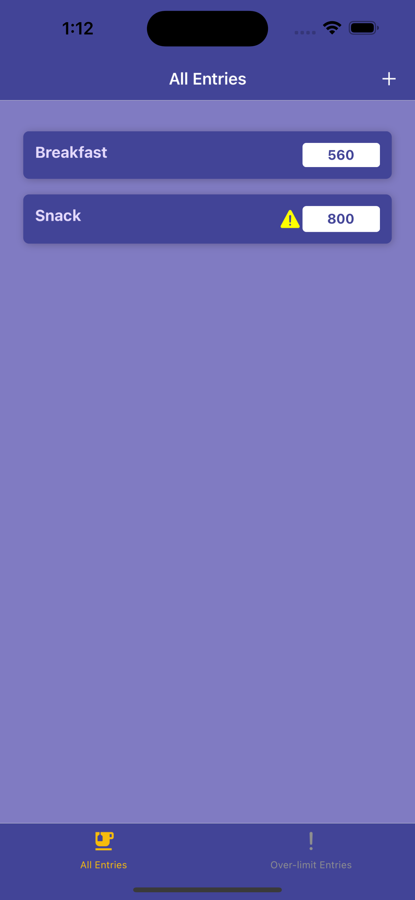
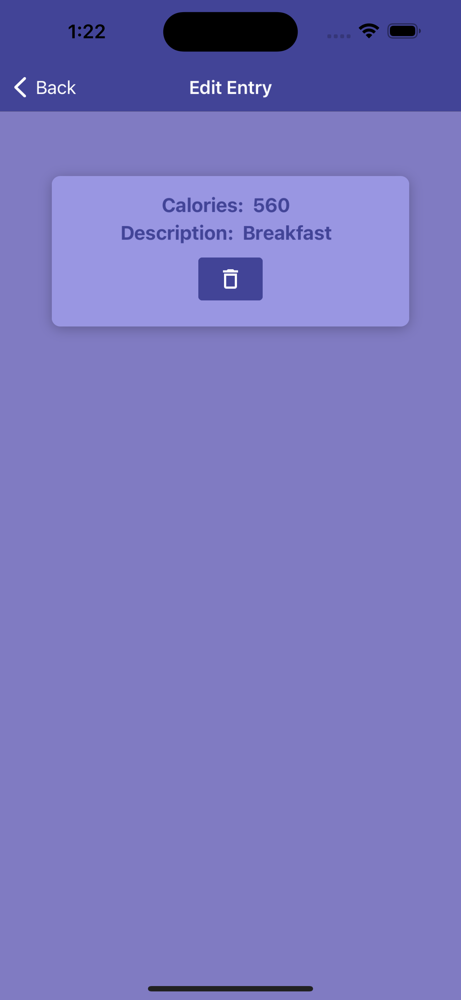
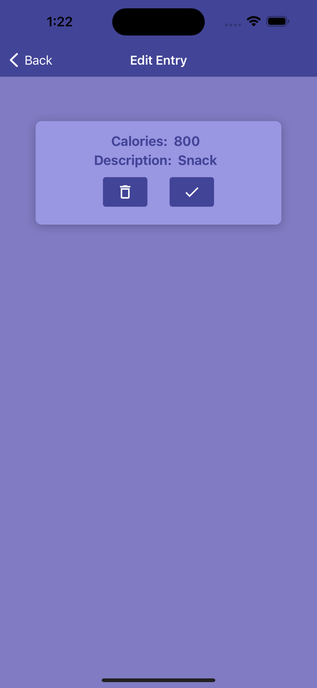

# Calorie Tracker App

The Calorie Tracker App is a cross-platform mobile application built using React Native. This app allows users to track their daily calorie intake, manage entries, and store data in a Firebase Firestore database. The application is designed to work seamlessly on both iOS and Android devices.

## Features

- **All Entries Screen**: View a list of all meal entries with calorie counts.
  
  

- **Over-limit Entries Screen**: Automatically mark and view entries with calorie counts over 500.
  
  

- **Edit Entry**: Update or delete existing entries, and mark over-limit entries as reviewed.

  
  

- **Add Entry**: Add new meal entries with validation for calorie and description inputs.
  
  

## Technologies Used

- **React Native**: Framework for building the cross-platform mobile application.
- **Firebase Firestore**: Cloud-hosted NoSQL database for backend database to store and sync data in real-time.
- **React Navigation**: For navigating between screens using a nested navigation structure.
- **Environment Variables**: Using `react-native-dotenv` or `react-native-config` for secure configuration management.
- **JavaScript**: The primary programming language used for app development.
- **Expo**: Simplifies building, deploying, and testing React Native apps.
- **Git and GitHub**: For version control and collaboration, facilitating code management and pull requests.
- **Android Studio / Xcode**: IDEs used for testing and debugging on Android and iOS.

## Setup Instructions

- **Clone the Repository:** Use `git clone` to download the repository onto your local machine and navigate into the project directory using `cd`.

- **Install Dependencies:** Use `npm install` to install all the necessary packages listed in the `package.json` file.

- **Set Up Firebase:**
  - Create a Firebase project in the Firebase Console and enable Firestore.
  - Configure security rules for Firestore to manage data access appropriately.

- **Environment Variables:**
  - Use a `.env` file to store your Firebase configuration securely. You can use packages like `react-native-dotenv` or `react-native-config` to load these variables.

- **Run the Application:**
  - Use the `npx react-native run-ios` command to run the app on an iOS simulator.
  - Use the `npx react-native run-android` command to run the app on an Android emulator.

This setup will ensure that your application is configured correctly with Firebase and can be tested on both iOS and Android platforms.

